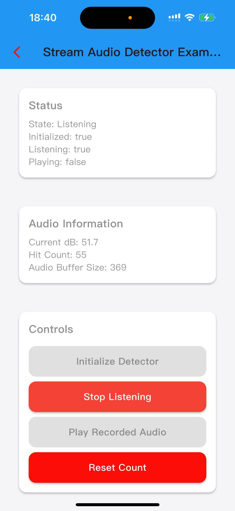

# StreamAudioDetector 技术手册 / Technical Manual

<div align="center">

[🇨🇳 中文](#中文版) | [🇺🇸 English](#english-version)

</div>

---

## 中文版

### 📋 目录
- [概述](#概述)
- [核心特性](#核心特性)
- [技术架构](#技术架构)
- [音频检测机制](#音频检测机制)
- [配置参数](#配置参数)
- [API 参考](#api-参考)
- [使用案例](#使用案例)

---

## 概述

`StreamAudioDetector` 是一个基于 `flutter_sound` 的高性能音频检测器，专门用于实时音频录制、处理和播放。它采用双重检测机制，能够准确识别击打声音并支持音频回放功能。

### 🎯 主要用途
- 实时音频录制和流处理
- 击打声音检测（适用于健身、游戏等场景）
- 音频数据分析和处理
- 录制音频的回放功能

---

## 核心特性

### ✅ 双重检测机制
1. **振幅检测** - 基于音频振幅的实时检测
2. **音频数据流检测** - 基于原始音频数据的精确分析

### ✅ 音频处理能力
- 支持多种音频格式（PCM Float32, PCM16, 交错模式）
- 实时 RMS 能量计算
- 分贝值转换和阈值检测
- 音频数据缓冲和流式处理

### ✅ 智能防抖机制
- 最小时间间隔控制
- 不同检测方式的时间间隔差异化
- 防止误触发的智能过滤

---

## 音频检测机制

### 🎤 双重检测系统

#### 1. 振幅检测 (Amplitude Detection)
- **数据源**: `_recorder.onProgress!.listen()`
- **检测频率**: 100ms 间隔
- **阈值**: `_dbThreshold = 50.0 dB`
- **时间间隔**: `_minStrikeInterval = 200ms`

```dart
void _processAmplitudeData(RecordingDisposition e) {
  _currentDb = e.decibels ?? 0.0;
  _checkStrikeFromAmplitude(_currentDb);
}
```

#### 2. 音频数据流检测 (Audio Data Stream Detection)
- **数据源**: 原始音频数据流
- **检测频率**: 实时流处理
- **阈值**: `_dbThreshold * 1.2 = 60.0 dB` (更高精度)
- **时间间隔**: `_minStrikeInterval * 1.5 = 300ms` (更严格)

```dart
void _processAudioData(List<Float32List> audioData) {
  double rmsEnergy = _calculateRMSEnergy(audioData);
  double dbFromAudio = _rmsToDecibels(rmsEnergy);
  if (dbFromAudio > _dbThreshold * 1.2) {
    _checkStrikeFromAudioData(dbFromAudio);
  }
}
```

### 📈 检测参数对比

| 检测方式 | 阈值 (dB) | 时间间隔 (ms) | 精度 | 用途 |
|---------|-----------|---------------|------|------|
| 振幅检测 | 50.0 | 200 | 中等 | 快速响应 |
| 音频流检测 | 60.0 | 300 | 高 | 精确识别 |

---

## 配置参数

### 🎛️ 音频配置

```dart
// 音频配置常量
static const int _sampleRate = 48000;        // 采样率
static const int _numChannels = 1;           // 声道数（单声道）
static const int _bufferSize = 1024;         // 缓冲区大小
static const Duration _subscriptionDuration = Duration(milliseconds: 100); // 订阅间隔
```

### ⚙️ 检测参数

```dart
// 检测参数
static const double _dbThreshold = 50.0;     // 基础分贝阈值
static const int _minStrikeInterval = 200;   // 最小击打间隔（毫秒）

// 状态变量
double _currentDb = 0.0;                     // 当前分贝值
int _hitCount = 0;                           // 击打计数
DateTime? _lastStrikeTime;                   // 上次击打时间
```

---

## API 参考

### 🔧 初始化方法

#### `initialize()`
初始化音频检测器
```dart
Future<bool> initialize() async
```

#### `startListening()`
开始监听麦克风输入
```dart
Future<bool> startListening() async
```

#### `stopListening()`
停止监听
```dart
Future<void> stopListening() async
```

### 🎵 音频播放

#### `playRecordedAudio()`
播放录制的音频
```dart
Future<void> playRecordedAudio() async
```

### 📊 状态获取

```dart
bool get isListening;        // 是否正在监听
bool get isInitialized;      // 是否已初始化
double get currentDb;        // 当前分贝值
int get hitCount;           // 击打计数
int get audioBufferSize;    // 音频缓冲区大小
```

### 🔄 回调函数

```dart
VoidCallback? onStrikeDetected;      // 击打检测回调
Function(String)? onError;           // 错误回调
Function(String)? onStatusUpdate;    // 状态更新回调
```

---

## 使用案例

### 🎯 基础使用流程

```dart
// 1. 创建检测器实例
final detector = StreamAudioDetector();

// 2. 设置回调函数
detector.onStrikeDetected = () {
  print('击打检测到！计数: ${detector.hitCount}');
};

// 3. 初始化
final success = await detector.initialize();

// 4. 开始监听
if (success) {
  await detector.startListening();
}

// 5. 停止监听
await detector.stopListening();

// 6. 播放录制的音频
await detector.playRecordedAudio();

// 7. 释放资源
detector.dispose();
```

---

## 性能优化建议

### 🚀 优化策略

1. **合理设置阈值**
   - 根据环境调整 `_dbThreshold`
   - 避免过于敏感或迟钝

2. **时间间隔调优**
   - 根据应用场景调整 `_minStrikeInterval`
   - 平衡响应速度和准确性

3. **音频模式选择**
   - 单声道模式减少计算量
   - 根据需求选择音频编码格式

### ⚠️ 注意事项

1. **权限处理**
   - 确保应用有麦克风权限
   - 处理权限被拒绝的情况

2. **错误处理**
   - 实现完整的错误回调
   - 提供用户友好的错误提示

---

---

# StreamAudioDetector 使用案例手册

## 📱 完整示例应用
<p style="text-align:center;">
  
</p>

### 🎯 示例概述

`StreamAudioDetectorExample` 是一个完整的 Flutter 应用示例，展示了如何使用 `StreamAudioDetector` 进行音频检测和播放。

---

## 应用结构

### 🏗️ 组件架构

```
StreamAudioDetectorExample
├── 状态管理
│   ├── _isInitialized (初始化状态)
│   ├── _isListening (监听状态)
│   ├── _isPlaying (播放状态)
│   └── _status (状态信息)
├── 数据监控
│   ├── _hitCount (击打计数)
│   ├── _currentDb (当前分贝)
│   └── _audioBufferSize (音频缓冲区大小)
└── UI 组件
    ├── 状态卡片
    ├── 音频信息卡片
    ├── 控制按钮
    └── 使用说明
```

---

## 核心功能实现

### 🔧 初始化设置

```dart
void _setupDetector() {
  // 击打检测回调
  _detector.onStrikeDetected = () {
    setState(() {
      _hitCount = _detector.hitCount;
    });
    print('🎯 Strike detected! Count: $_hitCount');
  };
  
  // 错误处理回调
  _detector.onError = (error) {
    setState(() {
      _status = 'Error: $error';
    });
    print('❌ Error: $error');
  };
  
  // 状态更新回调
  _detector.onStatusUpdate = (status) {
    setState(() {
      _status = status;
    });
    print('📝 Status: $status');
  };
}
```

### 🎤 音频监听控制

```dart
Future<void> _startListening() async {
  if (!_isInitialized) {
    await _initializeDetector();
  }
  
  setState(() {
    _status = 'Starting...';
  });
  
  final success = await _detector.startListening();
  setState(() {
    _isListening = success;
    _status = success ? 'Listening' : 'Failed to start';
  });
  
  if (success) {
    // 启动实时监控
    Timer.periodic(Duration(milliseconds: 100), (timer) {
      if (!_isListening) {
        timer.cancel();
        return;
      }
      
      setState(() {
        _currentDb = _detector.currentDb;
        _audioBufferSize = _detector.audioBufferSize;
      });
    });
  }
}
```

---

## 使用流程

### 📋 操作步骤

#### 步骤 1: 初始化
1. 点击 "Initialize Detector" 按钮
2. 等待初始化完成
3. 检查状态显示 "Initialized"

#### 步骤 2: 开始监听
1. 点击 "Start Listening" 按钮
2. 状态变为 "Listening"
3. 开始实时监控音频输入

#### 步骤 3: 测试检测
1. 对着麦克风发出声音（拍手、敲击等）
2. 观察 "Hit Count" 增加
3. 查看 "Current dB" 实时变化

#### 步骤 4: 停止监听
1. 点击 "Stop Listening" 按钮
2. 状态变为 "Stopped"
3. 停止音频监控

#### 步骤 5: 播放音频
1. 确保有录制的音频数据
2. 点击 "Play Recorded Audio" 按钮
3. 播放录制的音频内容

---

## 功能特性

### 🎯 实时监控
- 100ms 间隔的实时数据更新
- 动态分贝值显示
- 实时击打计数

### 📊 数据可视化
- 当前分贝值显示
- 击打计数统计
- 音频缓冲区大小监控

### 🎵 音频回放
- 录制音频的完整回放
- 播放状态管理
- 错误处理和提示

---

## 最佳实践

### 💡 使用建议

1. **环境准备**
   - 确保安静的环境进行测试
   - 避免背景噪音干扰

2. **设备选择**
   - 使用高质量麦克风
   - 确保设备支持音频录制

3. **参数调优**
   - 根据环境调整检测阈值
   - 平衡灵敏度和准确性

### ⚠️ 注意事项

1. **权限管理**
   - 确保应用有麦克风权限
   - 处理权限被拒绝的情况

2. **性能优化**
   - 避免过度频繁的状态更新
   - 及时释放资源

3. **错误处理**
   - 实现完整的错误处理机制
   - 提供用户友好的错误信息

---

## 总结

`StreamAudioDetector` 提供了：

- ✅ 双重检测机制（振幅 + 音频流）
- ✅ 不同阈值和时间间隔的智能控制
- ✅ 完整的音频录制和播放功能
- ✅ 实时数据监控和状态管理
- ✅ 用户友好的示例应用

通过这个技术手册，开发者可以：
1. 深入理解音频检测的工作原理
2. 快速上手音频检测功能
3. 根据需求进行功能扩展
4. 应用到实际的音频检测项目中

---

*本手册提供了 `StreamAudioDetector` 的完整技术文档和使用案例，帮助开发者快速上手和深入理解音频检测技术。*

---

## English Version

### 📋 Table of Contents
- [Overview](#overview)
- [Core Features](#core-features)
- [Technical Architecture](#technical-architecture)
- [Audio Detection Mechanism](#audio-detection-mechanism)
- [Configuration Parameters](#configuration-parameters)
- [API Reference](#api-reference)
- [Usage Examples](#usage-examples)

---

## Overview

`StreamAudioDetector` is a high-performance audio detector based on `flutter_sound`, specifically designed for real-time audio recording, processing, and playback. It employs a dual detection mechanism that can accurately identify strike sounds and support audio playback functionality.

### 🎯 Main Applications
- Real-time audio recording and stream processing
- Strike sound detection (suitable for fitness, gaming, etc.)
- Audio data analysis and processing
- Recorded audio playback functionality

---

## Core Features

### ✅ Dual Detection Mechanism
1. **Amplitude Detection** - Real-time detection based on audio amplitude
2. **Audio Data Stream Detection** - Precise analysis based on raw audio data

### ✅ Audio Processing Capabilities
- Support for multiple audio formats (PCM Float32, PCM16, Interleaved mode)
- Real-time RMS energy calculation
- Decibel conversion and threshold detection
- Audio data buffering and stream processing

### ✅ Smart Debouncing Mechanism
- Minimum time interval control
- Differentiated time intervals for different detection methods
- Intelligent filtering to prevent false triggers

---

## Audio Detection Mechanism

### 🎤 Dual Detection System

#### 1. Amplitude Detection
- **Data Source**: `_recorder.onProgress!.listen()`
- **Detection Frequency**: 100ms intervals
- **Threshold**: `_dbThreshold = 50.0 dB`
- **Time Interval**: `_minStrikeInterval = 200ms`

```dart
void _processAmplitudeData(RecordingDisposition e) {
  _currentDb = e.decibels ?? 0.0;
  _checkStrikeFromAmplitude(_currentDb);
}
```

#### 2. Audio Data Stream Detection
- **Data Source**: Raw audio data stream
- **Detection Frequency**: Real-time stream processing
- **Threshold**: `_dbThreshold * 1.2 = 60.0 dB` (higher precision)
- **Time Interval**: `_minStrikeInterval * 1.5 = 300ms` (stricter)

```dart
void _processAudioData(List<Float32List> audioData) {
  double rmsEnergy = _calculateRMSEnergy(audioData);
  double dbFromAudio = _rmsToDecibels(rmsEnergy);
  if (dbFromAudio > _dbThreshold * 1.2) {
    _checkStrikeFromAudioData(dbFromAudio);
  }
}
```

### 📈 Detection Parameter Comparison

| Detection Method | Threshold (dB) | Time Interval (ms) | Precision | Purpose |
|------------------|----------------|-------------------|-----------|---------|
| Amplitude Detection | 50.0 | 200 | Medium | Fast Response |
| Audio Stream Detection | 60.0 | 300 | High | Precise Recognition |

---

## Configuration Parameters

### 🎛️ Audio Configuration

```dart
// Audio configuration constants
static const int _sampleRate = 48000;        // Sample rate
static const int _numChannels = 1;           // Number of channels (mono)
static const int _bufferSize = 1024;         // Buffer size
static const Duration _subscriptionDuration = Duration(milliseconds: 100); // Subscription interval
```

### ⚙️ Detection Parameters

```dart
// Detection parameters
static const double _dbThreshold = 50.0;     // Base decibel threshold
static const int _minStrikeInterval = 200;   // Minimum strike interval (milliseconds)

// State variables
double _currentDb = 0.0;                     // Current decibel level
int _hitCount = 0;                           // Strike count
DateTime? _lastStrikeTime;                   // Last strike time
```

---

## API Reference

### 🔧 Initialization Methods

#### `initialize()`
Initialize the audio detector
```dart
Future<bool> initialize() async
```

#### `startListening()`
Start listening to microphone input
```dart
Future<bool> startListening() async
```

#### `stopListening()`
Stop listening
```dart
Future<void> stopListening() async
```

### 🎵 Audio Playback

#### `playRecordedAudio()`
Play recorded audio
```dart
Future<void> playRecordedAudio() async
```

### 📊 Status Retrieval

```dart
bool get isListening;        // Whether currently listening
bool get isInitialized;      // Whether initialized
double get currentDb;        // Current decibel level
int get hitCount;           // Strike count
int get audioBufferSize;    // Audio buffer size
```

### 🔄 Callback Functions

```dart
VoidCallback? onStrikeDetected;      // Strike detection callback
Function(String)? onError;           // Error callback
Function(String)? onStatusUpdate;    // Status update callback
```

---

## Usage Examples

### 🎯 Basic Usage Flow

```dart
// 1. Create detector instance
final detector = StreamAudioDetector();

// 2. Set up callbacks
detector.onStrikeDetected = () {
  print('Strike detected! Count: ${detector.hitCount}');
};

// 3. Initialize
final success = await detector.initialize();

// 4. Start listening
if (success) {
  await detector.startListening();
}

// 5. Stop listening
await detector.stopListening();

// 6. Play recorded audio
await detector.playRecordedAudio();

// 7. Dispose resources
detector.dispose();
```

---

## Performance Optimization Recommendations

### 🚀 Optimization Strategies

1. **Reasonable Threshold Setting**
   - Adjust `_dbThreshold` based on environment
   - Avoid being too sensitive or sluggish

2. **Time Interval Tuning**
   - Adjust `_minStrikeInterval` based on application scenario
   - Balance response speed and accuracy

3. **Audio Mode Selection**
   - Mono mode reduces computational load
   - Choose audio encoding format based on requirements

### ⚠️ Important Notes

1. **Permission Handling**
   - Ensure app has microphone permissions
   - Handle permission denial scenarios

2. **Error Handling**
   - Implement complete error callbacks
   - Provide user-friendly error messages

---

---

# StreamAudioDetector Usage Case Manual

## 📱 Complete Example Application
<p style="text-align:center;">
  
</p>

### 🎯 Example Overview

`StreamAudioDetectorExample` is a complete Flutter application example that demonstrates how to use `StreamAudioDetector` for audio detection and playback.

---

## Application Structure

### 🏗️ Component Architecture

```
StreamAudioDetectorExample
├── State Management
│   ├── _isInitialized (initialization status)
│   ├── _isListening (listening status)
│   ├── _isPlaying (playback status)
│   └── _status (status information)
├── Data Monitoring
│   ├── _hitCount (strike count)
│   ├── _currentDb (current decibel)
│   └── _audioBufferSize (audio buffer size)
└── UI Components
    ├── Status Card
    ├── Audio Info Card
    ├── Control Buttons
    └── Usage Instructions
```

---

## Core Function Implementation

### 🔧 Initialization Setup

```dart
void _setupDetector() {
  // Strike detection callback
  _detector.onStrikeDetected = () {
    setState(() {
      _hitCount = _detector.hitCount;
    });
    print('🎯 Strike detected! Count: $_hitCount');
  };
  
  // Error handling callback
  _detector.onError = (error) {
    setState(() {
      _status = 'Error: $error';
    });
    print('❌ Error: $error');
  };
  
  // Status update callback
  _detector.onStatusUpdate = (status) {
    setState(() {
      _status = status;
    });
    print('📝 Status: $status');
  };
}
```

### 🎤 Audio Listening Control

```dart
Future<void> _startListening() async {
  if (!_isInitialized) {
    await _initializeDetector();
  }
  
  setState(() {
    _status = 'Starting...';
  });
  
  final success = await _detector.startListening();
  setState(() {
    _isListening = success;
    _status = success ? 'Listening' : 'Failed to start';
  });
  
  if (success) {
    // Start real-time monitoring
    Timer.periodic(Duration(milliseconds: 100), (timer) {
      if (!_isListening) {
        timer.cancel();
        return;
      }
      
      setState(() {
        _currentDb = _detector.currentDb;
        _audioBufferSize = _detector.audioBufferSize;
      });
    });
  }
}
```

---

## Usage Flow

### 📋 Operation Steps

#### Step 1: Initialization
1. Click "Initialize Detector" button
2. Wait for initialization to complete
3. Check status shows "Initialized"

#### Step 2: Start Listening
1. Click "Start Listening" button
2. Status changes to "Listening"
3. Begin real-time audio input monitoring

#### Step 3: Test Detection
1. Make sounds into microphone (clap, tap, etc.)
2. Observe "Hit Count" increase
3. Watch "Current dB" real-time changes

#### Step 4: Stop Listening
1. Click "Stop Listening" button
2. Status changes to "Stopped"
3. Stop audio monitoring

#### Step 5: Play Audio
1. Ensure recorded audio data exists
2. Click "Play Recorded Audio" button
3. Play recorded audio content

---

## Feature Characteristics

### 🎯 Real-time Monitoring
- Real-time data updates at 100ms intervals
- Dynamic decibel level display
- Real-time strike counting

### 📊 Data Visualization
- Current decibel level display
- Strike count statistics
- Audio buffer size monitoring

### 🎵 Audio Playback
- Complete playback of recorded audio
- Playback status management
- Error handling and prompts

---

## Best Practices

### 💡 Usage Recommendations

1. **Environment Preparation**
   - Ensure quiet environment for testing
   - Avoid background noise interference

2. **Device Selection**
   - Use high-quality microphone
   - Ensure device supports audio recording

3. **Parameter Tuning**
   - Adjust detection threshold based on environment
   - Balance sensitivity and accuracy

### ⚠️ Important Considerations

1. **Permission Management**
   - Ensure app has microphone permissions
   - Handle permission denial scenarios

2. **Performance Optimization**
   - Avoid overly frequent state updates
   - Release resources promptly

3. **Error Handling**
   - Implement complete error handling mechanism
   - Provide user-friendly error messages

---

## Summary

`StreamAudioDetector` provides:

- ✅ Dual detection mechanism (amplitude + audio stream)
- ✅ Intelligent control with different thresholds and time intervals
- ✅ Complete audio recording and playback functionality
- ✅ Real-time data monitoring and status management
- ✅ User-friendly example application

Through this technical manual, developers can:
1. Deeply understand the working principles of audio detection
2. Quickly get started with audio detection functionality
3. Extend functionality based on requirements
4. Apply to actual audio detection projects

---

*This manual provides complete technical documentation and usage cases for `StreamAudioDetector`, helping developers quickly get started and deeply understand audio detection technology.*
